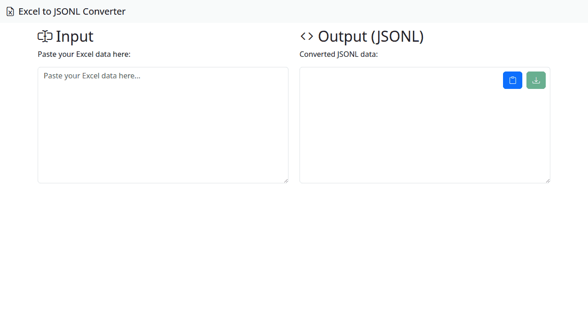

# Excel to JSONL Converter

This tool converts Excel files (.xlsx, .xls) into JSONL (JSON Lines) format.

## Use Cases

- **Data Preparation for Machine Learning:** Convert Excel data into a format suitable for training machine learning models.
- **Data Interchange:** Transform Excel data into a more structured and widely compatible format for use in other applications or systems.
- **Log Processing:** Convert spreadsheet logs into JSONL for easier parsing and analysis.

## How It Works

1.  **Upload Excel File:** The user uploads an Excel file through the web interface.
2.  **Processing:** The tool parses the Excel file, extracting data from each row.
3.  **Download JSONL:** The user can then download the converted data as a JSONL file, where each line is a JSON object representing a row from the original Excel file.
