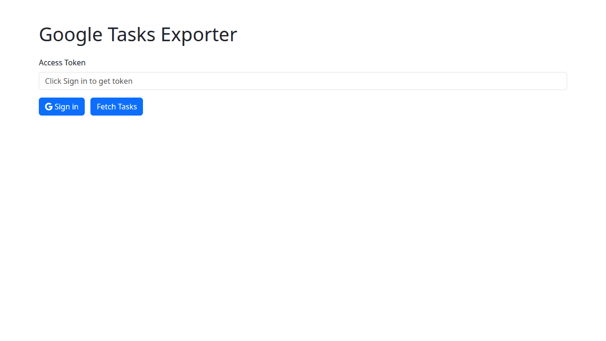

# Google Tasks Exporter

This tool lets you sign in with your Google account and download all of your tasks as a CSV file.
It also lets you copy the results straight into Excel or Markdown, and delete all completed tasks.

## How it works

1. Click **Sign in** and approve access to your Google Tasks.
2. Click **Fetch Tasks** to list all tasks from every list, including completed ones.
3. Use **Download CSV**, **Copy to Excel**, or **Copy to Markdown** to export the table.
4. **Delete Completed** removes all tasks marked as completed.
5. Sub-tasks show up as bullet points in the notes of their parent tasks.
6. Markdown exports keep line breaks and nested bullets from the notes.

Your access token is stored locally in your browser using `saveform`.
