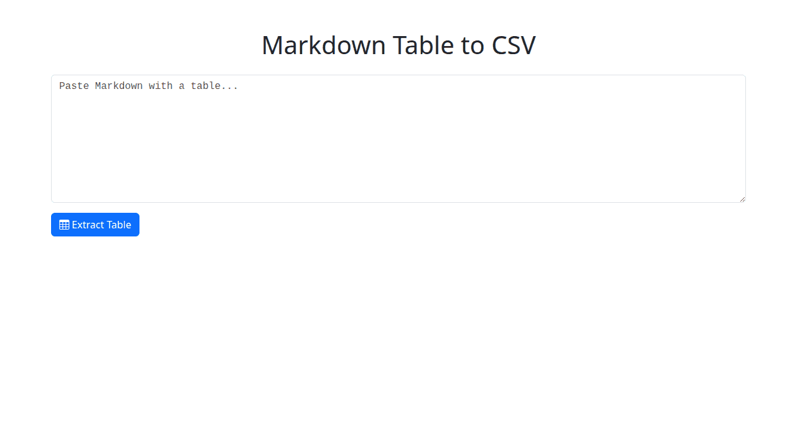

# Markdown Table to CSV

Extract the first table from Markdown and convert it to CSV. Links become their text and images are removed.

## What it does

- Paste Markdown text containing a table
- Click **Extract Table** to parse the first table using `marked`
- Links are reduced to plain text and images removed
- The table is shown on screen
- Data can be **Download CSV** or **Copy to Excel** (TSV)

## Use Cases

- Reuse tables from READMEs or documents in spreadsheets
- Quickly clean up Markdown tables for data analysis

## How It Works

1. `marked` locates the first table token and provides cell tokens
2. Cell tokens are flattened to plain text, dropping URLs and images
3. The data is converted to CSV with utilities in `common/csv.js`
4. The table preview also relies on these shared helpers
