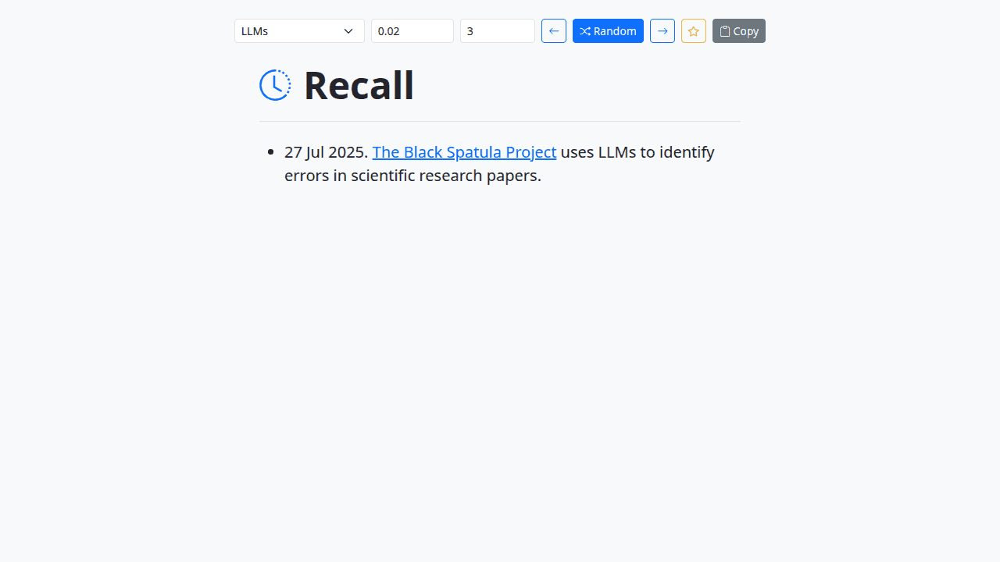

# Recall

Recall is a spaced repetition viewer. It loads a Markdown file, picks a list item using an exponentially decaying weight, and shows it for quick review.

## Features

- Choose from preset Markdown files
- Adjustable decay factor for selection probability
- Random, Previous, Next, Copy, and ⭐ buttons for navigation and filtering
- Editable index field to jump directly to a bullet
- Search box with fuzzy matching

This tool is mobile responsive and styled with Bootstrap, similar to the Podcast Generator tool.
