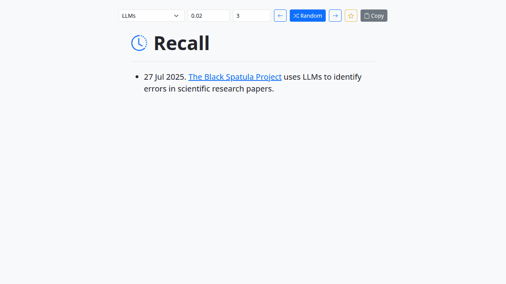

# Recall

Randomly recall list items from Markdown.

## Features

- Choose from preset Markdown files
- Adjustable decay factor for selection probability
- Random, Previous, Next, Copy, and ⭐ buttons for navigation and filtering
- Editable index field to jump directly to a bullet
- Search box with fuzzy matching (shows top 5 matches; navigation respects filters)

This tool is mobile responsive and styled with Bootstrap, similar to the Podcast Generator tool.
