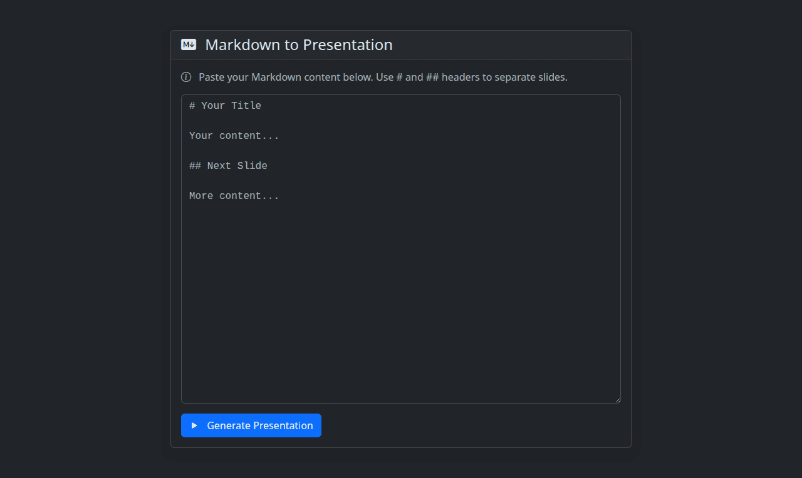

# Markdown to Reveal.js Presentation Generator

This tool provides a simple web interface to convert Markdown text into a Reveal.js HTML slideshow. It allows users to quickly create web-based presentations using familiar Markdown syntax.

## What it does

The tool takes Markdown input from a user and transforms it into a fully functional Reveal.js presentation.

- **Markdown Input:** Users write or paste their presentation content in Markdown.
- **Slide Separation:** `#` (H1) and `##` (H2) Markdown headers are used as delimiters to separate individual slides.
- **Markdown Parsing:** The content of each slide is parsed from Markdown to HTML.
- **Reveal.js Structure:** The parsed HTML is embedded within the standard HTML structure required by Reveal.js, including necessary CSS links and the Reveal.js initialization script.
- **In-Browser Preview:** The generated presentation is opened in a new browser tab/window.

## Use Cases

- **Quick Presentations:** Rapidly create simple, web-based slideshows without needing complex presentation software.
- **Markdown-First Workflow:** Ideal for users who prefer writing content in Markdown and need a straightforward way to present it.
- **Lightweight Presentations:** Generate presentations that are easy to share and view in any modern web browser.
- **Technical Talks:** Suitable for developers or technical presenters who are comfortable with Markdown for content creation.

## How It Works

1.  **Input Markdown:**

    - The user enters their presentation content in the provided textarea.
    - To create new slides, the user starts a line with a `#` (Heading 1) or `##` (Heading 2). All content following such a header, until the next H1/H2 header or the end of the input, will belong to that slide.
    - The Markdown content is automatically saved to the browser's `localStorage`, so it persists if the page is reloaded.

2.  **Generate Presentation:**

    - The user clicks the "Generate Presentation" button.
    - The tool splits the input Markdown into an array of strings, where each string represents the Markdown content for one slide. The split occurs at lines beginning with `# ` or `## `.
    - Each slide's Markdown content is individually converted to HTML using the `Marked` JavaScript library.
    - A complete HTML page is constructed, embedding:
      - CDN links to Reveal.js core CSS files (`reset.css`, `reveal.css`) and a default theme (`white.css`).
      - The HTML content for each slide, wrapped in `<section>` tags, inside the Reveal.js `

...

` structure.
      - A `<script>` tag to include the Reveal.js library and another `<script>` block to initialize it with default settings (dimensions, navigation, transition style).

3.  **View Presentation:**
    - The generated HTML for the presentation is written to a new browser window or tab (`window.open()`), allowing the user to immediately view and navigate their slideshow.

The tool uses Bootstrap for styling the input page and the `Marked` library for Markdown conversion. Reveal.js itself is loaded via CDN links in the generated presentation.
