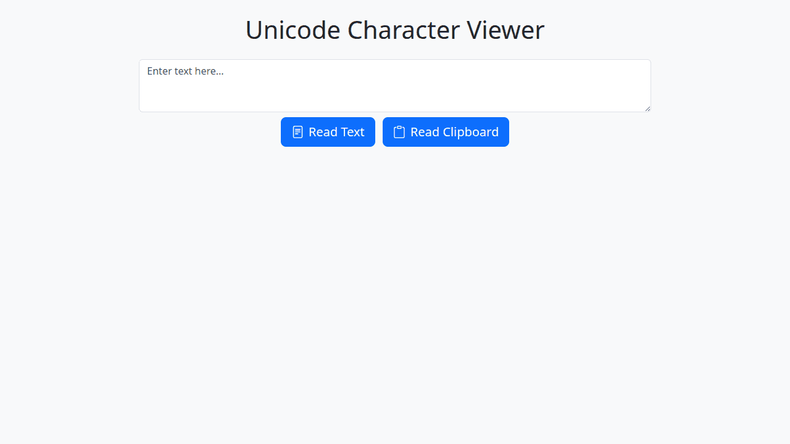

# Unicode Character Viewer

This tool helps users identify, view, and copy non-ASCII Unicode characters present in a given text. It provides a clear display of each unique non-ASCII character along with its hexadecimal and decimal Unicode code points.

## What it does

The Unicode Character Viewer processes text input (either from a textarea or the system clipboard) and extracts all unique characters whose Unicode code points are greater than 127 (i.e., characters outside the standard ASCII range). For each such character, it displays:

- The character itself.
- Its official Unicode code point in hexadecimal notation (e.g., U+00E9 for "é").
- Its decimal Unicode code point.

Users can then easily copy any of these individual characters to their clipboard by clicking on its display card.

## Use Cases

- **Developers & Web Designers:** Identify and inspect special characters in text data, ensuring correct encoding and display. Useful when dealing with internationalized content, special symbols, or emojis.
- **Content Editors & Writers:** Find, verify, and easily copy specific Unicode characters (e.g., accented letters, typographic symbols like em-dashes or curly quotes, mathematical symbols) that might be hard to type directly.
- **Data Cleaning:** Help identify unexpected or problematic non-ASCII characters in a dataset.
- **Learning & Exploration:** Explore the variety of characters available in Unicode beyond the basic ASCII set.

## How It Works

1.  **Input Text:**

    - **Textarea:** The user can type or paste text directly into the provided textarea and then click the "Read Text" button.
    - **Clipboard:** The user can click the "Read Clipboard" button. The browser will likely ask for permission to access clipboard content. If granted, the text from the clipboard is read. A spinner is shown during this process.

2.  **Character Processing:**

    - The tool iterates through the input text character by character.
    - It identifies all unique characters whose Unicode code point is greater than 127.

3.  **Displaying Characters:**

    - The identified non-ASCII characters are displayed in a container as individual "cards" or buttons.
    - Each card prominently shows:
      - The character itself.
      - Its Unicode value in the format `U+XXXX` (hexadecimal).
      - Its decimal Unicode value (e.g., `DEC: XXXX`).
    - If no non-ASCII characters are found in the input text, a message "No non-ASCII characters found." is displayed.

4.  **Copying Characters:**

    - Clicking on any character card copies that specific character to the user's clipboard.
    - The card briefly changes its appearance (e.g., highlights green) to confirm the copy action.

5.  **Error Notifications:**
    - If there's an issue (e.g., reading from the clipboard fails), an error message is displayed as a toast notification.

The tool is built with HTML, Bootstrap for styling, and client-side JavaScript. It relies on standard browser APIs for text processing and clipboard interaction.
