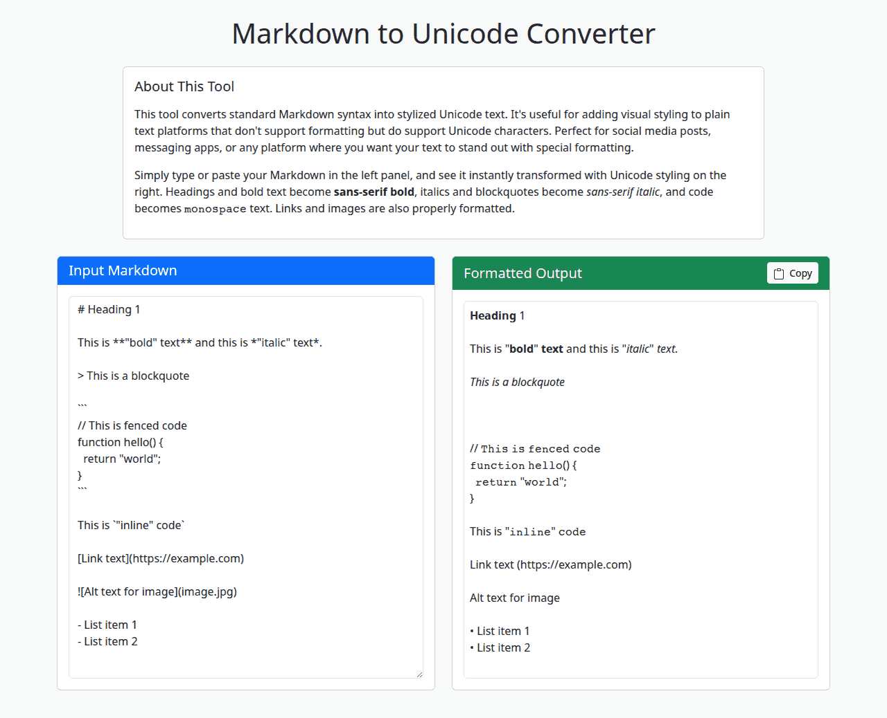

# Markdown ↔ Unicode "Fancy Text" Converter

This tool converts between standard Markdown syntax and text styled with special Unicode characters in both directions. This allows you to create visually distinct text (e.g., bold, italic, monospace) that can be used on platforms that don't support traditional rich text formatting but do render a wide range of Unicode characters.

## What it does

The "Markdown ↔ Unicode Converter" performs bidirectional conversions:

### Markdown → Unicode

Takes Markdown input and applies specific Unicode character substitutions to simulate common formatting styles:

- **Headings & Bold Text:** Converted to **sans-serif bold** Unicode characters (e.g., "Hello World" becomes "𝗛𝗲𝗹𝗹𝗼 𝗪𝗼𝗿𝗹𝗱").
- **Italics & Blockquotes:** Converted to _sans-serif italic_ Unicode characters (e.g., "Hello World" becomes "𝘏𝘦𝘭𝘭𝘰 𝘞𝘰𝘳𝘭𝘥").
- **Code (Fenced & Inline):** Converted to 𝚖𝚘𝚗𝚘𝚜𝚙𝚊𝚌𝚎 Unicode characters (e.g., "Hello World 123" becomes "𝙷𝚎𝚕𝚕𝚘 𝚆𝚘𝚛𝚕𝚍 𝟷𝟸𝟹").
- **Links:** Formatted as `link text (URL)`.
- **Images:** Represented by their alt text.
- **Lists:** List items are prefixed with a '•' character.

### Unicode → Markdown

Takes Unicode-styled text and converts it back to standard Markdown:

- **Sans-serif bold** characters → `**bold**`
- _Sans-serif italic_ characters → `*italic*`
- 𝚖𝚘𝚗𝚘𝚜𝚙𝚊𝚌𝚎 characters → `` `code` ``

The conversion happens in real-time as you type or paste text.

## Use Cases

- **Social Media Posts:** Make your posts stand out on platforms like Twitter, Instagram, Facebook, LinkedIn, etc., where standard Markdown or HTML formatting isn't supported in posts or profiles.
- **Messaging Apps:** Add emphasis or style to messages in apps like WhatsApp, Telegram, Discord, or Slack.
- **Usernames & Profiles:** Create unique-looking usernames or profile descriptions.
- **Plain Text Environments:** Add visual hierarchy or emphasis where only plain text is allowed but Unicode is supported (e.g., some forums, comments sections).

**Note:** While these Unicode characters mimic styling, they are technically different characters. Screen readers or systems with limited Unicode font support may not interpret or display them as intended. Use with consideration for accessibility.

## How It Works

The tool provides two conversion modes:

### Markdown → Unicode

1.  **Input Markdown:**

    - The user types or pastes Markdown content into the input textarea.
    - An example Markdown text is provided on page load to demonstrate functionality.

2.  **Live Conversion:**

    - As the user types, the input Markdown is parsed using the `marked` JavaScript library.
    - A custom renderer intercepts standard Markdown elements (headings, bold, italic, code, etc.).
    - Instead of outputting HTML, the renderer substitutes the text content with corresponding styled Unicode characters from the Mathematical Alphanumeric Symbols block and other Unicode ranges.
    - The resulting Unicode-styled text is immediately displayed in the output panel.

3.  **Copy Output:**
    - The user can click the "Copy" button to copy the generated Unicode-styled text to their clipboard.

### Unicode → Markdown

1.  **Input Unicode:**

    - The user pastes Unicode-styled text into the input textarea.

2.  **Style Detection:**

    - The tool analyzes each character to detect which Unicode style it uses.
    - Characters are converted back to ASCII and grouped by style.

3.  **Markdown Generation:**

    - Styled segments are wrapped with appropriate Markdown syntax.
    - Consecutive segments of the same style separated by spaces are intelligently merged.

4.  **Copy Output:**
    - The user can click the "Copy" button to copy the generated Markdown to their clipboard.

The tool is built with HTML, Bootstrap for styling, and client-side JavaScript. All processing happens directly in the browser using custom functions for bidirectional Unicode character mapping.

### Comparison with "Unicode Character Viewer"

This tool (`unicoder`) is distinct from the "Unicode Character Viewer":

- **`unicoder` (this tool):** _Generates_ text styled with specific Unicode characters based on Markdown input to create "fancy text."
- **`Unicode Character Viewer`:** _Identifies and displays existing_ non-ASCII Unicode characters from arbitrary text input, showing their code points.
