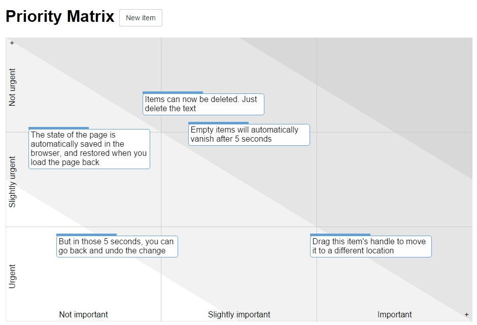

# What Next? - A Visual Priority Matrix

"What Next?" is a flexible, offline-first single-page application for visual prioritization. It allows you to organize tasks, ideas, or any items on a customizable grid, classically known as an Eisenhower (Urgency/Importance) Matrix, to help you decide what to focus on next.

Data is saved directly in your browser's local storage, making it fast and private. Optional synchronization across devices is possible via a user-configured Firebase backend.

[Use the app](http://sanand0.github.io/whatnext/)

## What it does

This tool provides a digital canvas where you can:
-   Place items (tasks, notes, ideas) onto a 2D grid.
-   Define the meaning of the grid's axes (e.g., Urgency vs. Importance, Cost vs. Benefit).
-   Visually assess priorities based on an item's position.
-   Manage multiple distinct priority matrices or "views."

## Use Cases

-   **Task Management:** Prioritize personal or work tasks using the classic Eisenhower Matrix (Urgent/Important).
-   **Decision Making:** Evaluate options based on custom criteria (e.g., Impact/Effort, Risk/Reward).
-   **Project Planning:** Organize project features or milestones.
-   **Idea Brainstorming & Sorting:** Visually sort and categorize ideas.
-   **Strategic Planning:** Map out strategic initiatives on a customizable grid.

## Key Features & How It Works

**Core Functionality:**
-   **Interactive Grid:**
    -   Items are placed on an SVG grid. Default axes are "Urgency" and "Importance."
    -   **Customizable Labels:** Click on axis labels (left/bottom) to edit them. Blank labels are removed, changing grid dimensions. Add new labels via "+" icons.
-   **Item Management:**
    -   **Add Items:** Click "New item" to add a task/note. It appears on the grid, ready to be dragged.
    -   **Edit Items:** Click an item to edit its text directly.
    -   **Move Items:** Drag items to different positions on the grid to change their priority.
    -   **Delete Items:** Clear the text within an item. It will be marked for deletion and disappear after 5 seconds if it remains empty and loses focus. (You can undo by quickly re-focusing and using Ctrl+Z).
    -   **Color Coding:** Ctrl-click an item to cycle through five preset border colors for visual differentiation.
-   **Offline Storage (Default):**
    -   All your items, axis labels, notes, and view configurations are automatically saved in your web browser's `localStorage`.
    -   The application loads your data when you revisit the page in the same browser. No internet connection is required for core functionality.
-   **Multiple Views:**
    -   Organize different projects or contexts into separate "views."
    -   Switch between views using the dropdown menu at the top right. Each view is a distinct matrix with its own items and labels, identified by a URL hash (e.g., `index.html#myproject`).
    -   Create new views or clear existing ones from this menu.
-   **Notes Area:** An editable section below the grid for any additional notes related to the current view.

**Optional Firebase Synchronization:**
-   **Publish:** You can save the state of your current view to a Firebase Realtime Database URL that you provide (requires a free Firebase account and setup of a `.json` endpoint).
-   **Refresh From:** Load data from a specified Firebase URL, overwriting the current view in your browser. This allows for manual synchronization across different browsers or machines.

## Technical Notes
-   The application is a single HTML file with embedded CSS and JavaScript.
-   It has no server-side backend dependencies for its core offline functionality.
-   A step-by-step [write-up on how this app was built](https://github.com/sanand0/whatnext/wiki) is available for those interested in the underlying technology.

## License
This software is released under the [MIT License](http://en.wikipedia.org/wiki/MIT_License).
