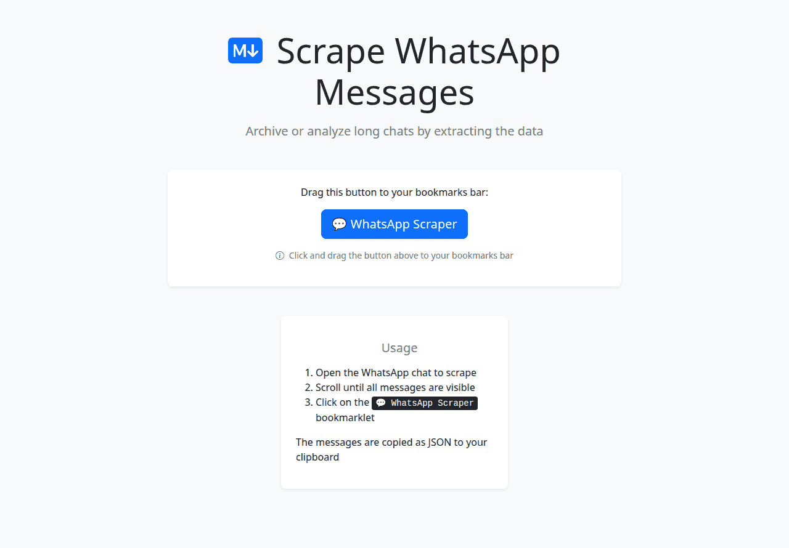

# WhatsApp Chat Scraper Bookmarklet

This tool is a browser bookmarklet that allows users to scrape messages from an active WhatsApp Web chat session. The extracted messages are compiled into a JSON format and copied to the user's clipboard.

## What it does

The WhatsApp Scraper extracts message data from the currently open chat in WhatsApp Web. To use it, a user navigates to WhatsApp Web, opens the desired chat, scrolls to load the message history they wish to capture, and then clicks the bookmarklet.

The scraper attempts to collect the following information for each message:

- Message ID
- Author's phone number identifier
- Author's display name
- Message text
- Link details (URL, site, preview title/description when available)
- Timestamp (derived from message metadata or display)
- Whether it's a system message (e.g., "User joined")
- Whether it's a recalled (deleted) message
- Details of any quoted message (author, text, and an attempt to link to the original quoted message ID)
- Reactions to the message

The collected data is structured as a JSON array of message objects, which is then copied to the clipboard.

Link previews (when WhatsApp renders them) are captured in:

- `linkUrl`
- `linkSite`
- `linkTitle` (optional)
- `linkDescription` (optional)

## Use Cases

- **Personal Chat Backup:** Create a personal, offline backup of important WhatsApp conversations.
- **Data Analysis:** Analyze personal chat patterns, common phrases, or message frequency (for personal use only).
- **Information Retrieval:** Easily search through a large volume of messages once extracted, using tools that can process JSON.

**Important Considerations:**

- **Privacy & Ethics:** This tool scrapes data that is visible to you in your WhatsApp Web session. Be mindful of privacy and obtain consent if you are scraping shared conversations. Respect WhatsApp's terms of service. The scraped data is for personal use.
- **WhatsApp Web Updates:** WhatsApp Web's HTML structure can change. If it does, this scraper might stop working correctly or require updates to its selectors and parsing logic.
- **Performance:** Scraping very long chats by scrolling extensively might be resource-intensive for the browser.

## How It Works

1. **Installation (Setting up the Bookmarklet):**
   - Open the `index.html` file from this tool's directory in your browser.
   - Drag the "💬 WhatsApp Scraper" button displayed on that page to your browser's bookmarks bar. This creates the bookmarklet.
2. **Scraping Process:**
   - Go to [web.whatsapp.com](https://web.whatsapp.com/) and open the specific chat conversation you want to scrape.
   - Click the "💬 WhatsApp Scraper" bookmarklet from your browser's bookmarks bar. This displays a "Copy ... messages" button on the top right of WhatsApp.
   - **Crucially, scroll within the chat panel to load all the messages you intend to capture.** The scraper can only access messages that are currently rendered in the WhatsApp Web interface.
   - Click on the "Copy ... messages" button to copy the captured messages as JSON.
3. **Data Extraction:**
   - The bookmarklet executes JavaScript code in the context of the WhatsApp Web page.
   - This script queries the Document Object Model (DOM) to find HTML elements corresponding to messages.
   - It parses attributes and text content from these elements to extract message details (author, text, time, quotes, reactions).
   - Helper functions are used to process timestamps and other specific data points.
4. **Output:**
   - The extracted messages are formatted into a JSON string.
   - This JSON string is automatically copied to your clipboard.
   - Click the injected "Copy … messages" button to copy the JSON.

## CDP Verification

If you have a Chromium/Chrome instance running with the DevTools Protocol exposed (e.g. `--remote-debugging-port=9222`)
and an existing WhatsApp Web tab open, you can sanity-check the scraper output without using the bookmarklet:

- Build the bundled script: `npm --prefix whatsappscraper run build`
- Run the verifier: `node whatsappscraper/verify.mjs`

`verify.mjs` connects to `http://localhost:9222`, injects `whatsappscraper.min.js` into the WhatsApp Web tab, runs
`whatsappscraper.whatsappMessages(document)`, and prints a representative message (prefering one with link preview data).

## Technical Details

- The core scraping logic is in `whatsappscraper.js`.
- The `package.json` defines a build script using `esbuild` to bundle and minify `whatsappscraper.js` into `whatsappscraper.min.js`.
- The `index.html` page fetches this minified script to construct the `javascript:` URL for the bookmarklet.
- The tool is entirely client-side and runs within the user's browser. It does not involve any external server for the scraping process itself.
