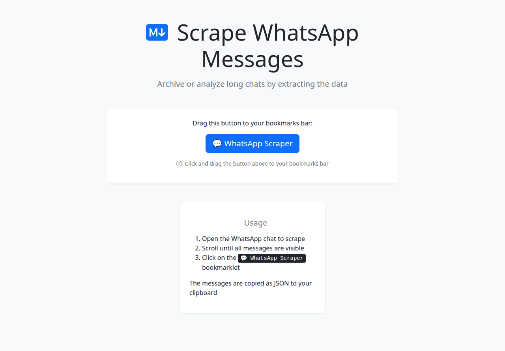

# WhatsApp Scraper

Scrape WhatsApp chat messages into JSON.



## What it does

The WhatsApp Scraper extracts message data from the currently open chat in WhatsApp Web. To use it, a user navigates to WhatsApp Web, opens the desired chat, scrolls to load the message history they wish to capture, and then clicks the bookmarklet.

The scraper attempts to collect the following information for each message:

- Message ID
- Chat identifier
- Whether the message was sent by you
- Author's phone number identifier
- Author's display name
- Message text
- Link details (URL, site, preview title/description when available)
- Timestamp (derived from message metadata or display)
- Whether it's a recalled (deleted) message
- Details of any quoted message (author, text, and an attempt to link to the original quoted message ID)
- Reactions to the message

The collected data is structured as a JSON array of message objects, which is then copied to the clipboard.

Link previews (when WhatsApp renders them) are captured in:

- `linkUrl`
- `linkSite`
- `linkTitle` (optional)
- `linkDescription` (optional)

## Output format

The bookmarklet copies a JSON array of message objects to the clipboard.

- Output is **best-effort**: fields are included only when they can be extracted from the currently-rendered DOM.
- Output is **de-duplicated** by `messageId` while you scroll. If the same message is observed multiple times, the scraper keeps the “richer” version with field-aware merging: longer string fields win, larger numeric media metadata wins, and `true` booleans are preserved.
- Output is **sorted by time** (ascending) when copied. Messages with missing/unknown `time` are sorted first.

### Message object schema

Each entry in the JSON array is a “message-like row” from WhatsApp Web’s `#main` history view.

```ts
type WhatsAppScrapedMessage = {
  messageId: string;
  userId?: string;
  isOutgoing?: true;
  isRecalled?: true;

  time?: string; // ISO 8601 string in clipboard JSON
  author?: string;
  authorPhone?: string;
  text?: string;
  mediaType?: "gif" | "image" | "voice";
  mediaCaption?: string;
  mediaWidth?: number;
  mediaHeight?: number;
  mediaDuration?: string;
  mediaDurationSeconds?: number;

  quoteAuthor?: string;
  quoteAuthorPhone?: string;
  quoteText?: string;
  quoteMessageId?: string;

  linkUrl?: string;
  linkSite?: string;
  linkTitle?: string;
  linkDescription?: string;

  reactions?: string;
};
```

### Field semantics

- `messageId`: Message identifier parsed from the row’s `data-id`. Used as the primary key for de-duplication and merging. Format is not documented by WhatsApp; it may change.
- `userId`: Best-effort chat identifier for the currently open thread. In older WhatsApp Web DOMs this was parsed from the row `data-id`; in newer DOMs it may be missing when WhatsApp no longer exposes the current chat JID cleanly in the visible DOM. Despite the name, this is **not** the message author.
- `isOutgoing`: Present only when WhatsApp marks the row as sent by the currently logged-in account. In older DOMs this came from the packed `data-id`; in newer DOMs it is inferred from the row structure such as `.message-out`.
- `isRecalled`: Present only when the row is a recalled/deleted message. Detected via `[data-icon="recalled"]`.
- `time`: Message timestamp as an ISO 8601 string. Parsed from `data-pre-plain-text` when available, otherwise inferred from the visible `HH:MM` / `H:MM am|pm` timestamp using the previous message date.
- `author`: Display name shown by WhatsApp for the sender. In group chats, WhatsApp sometimes omits the author UI for consecutive messages; the scraper inherits the previous author when WhatsApp clearly rendered the row as a continuation.
- `authorPhone`: Sender phone extracted from `data-pre-plain-text` (when present). This is a raw string like `+00 10000 00000` (not normalized). May be missing when WhatsApp doesn’t render `data-pre-plain-text`.
- `text`: Cleaned “human-visible” message content. Present for non-recalled rows when textual content can be extracted. Quoted text, author labels, timestamps, and reaction UI are stripped from the main message body. GIF rows are represented as `(media-gif)`.
- `mediaType`: Present for recognized media rows. Currently best-effort values are `gif`, `image`, and `voice`.
- `mediaCaption`: Best-effort informative caption for a media row. For images this may come from the image `alt` text or the media caption text rendered below the image.
- `mediaWidth` / `mediaHeight`: Best-effort media dimensions. The scraper prefers the asset’s natural size when available and otherwise falls back to the rendered box size.
- `mediaDuration`: Best-effort duration label for voice notes, e.g. `0:37`.
- `mediaDurationSeconds`: Numeric form of `mediaDuration` when it can be parsed safely.
- `quoteAuthor`: The quoted/replied-to author label. May be a display name (preferred) or a phone number string, depending on what WhatsApp renders in the quote header.
- `quoteAuthorPhone`: Digits-only phone number for the quoted author (when WhatsApp shows both phone + labeled name). Only set when the quote header contains both an unlabeled phone span and a labeled name span. Not guaranteed even when `quoteAuthor` is present.
- `quoteText`: Extracted quoted/replied-to snippet from the quote block. It is whitespace-normalized but keeps intentional paragraph breaks.
- `quoteMessageId`: Best-effort link to the earlier scraped message that the quote refers to. Only set when a previous scraped message has the same `author` as `quoteAuthor` **and** its `text` starts with `quoteText` (whitespace-normalized). This will be missing when the referenced message isn’t currently loaded/visible, has non-text content, or was edited.
- `linkUrl`: First external `http(s)` URL found in the row. Only the first link is captured even if the message contains multiple links.
- `linkSite`: Hostname of `linkUrl` (minus a leading `www.`). Present whenever `linkUrl` is present.
- `linkTitle`: Best-effort preview “title” extracted from the preview card text. Derived from the text immediately above the URL line in `row.innerText`, filtered to exclude author, quote, and timestamp UI.
- `linkDescription`: Best-effort preview “description” extracted from the preview card text. Same extraction approach as `linkTitle`; may be multi-line (joined with `\\n`).
- `reactions`: Human-readable reaction summary parsed from an `aria-label`. A normalized string like `👍, ❤ 4`. It is not a structured map of emoji → count.

### Link preview behavior

WhatsApp sometimes shows a “preview card” even when the message text is just the URL.

- If the message is **link-only** (the cleaned `text` matches the URL), the scraper appends `linkTitle` / `linkDescription` into `text` (joined with newlines) so downstream consumers see the same content as the WhatsApp bubble.
- If the message includes a **caption + link**, the preview fields are still extracted, but `text` remains the caption + URL (preview text is not appended).

## Rules and constraints (for refactors)

These are the observable invariants from the current implementation:

- Always emit `messageId` for every captured row.
- `userId` is best-effort and may be omitted when WhatsApp no longer exposes the current chat id cleanly.
- Only emit boolean flags when they are `true`.
- If `linkUrl` is present, `linkSite` should also be present and should correspond to `new URL(linkUrl).hostname` (minus `www.`).
- If `quoteText` is present, `quoteAuthor` should usually be present, but `quoteAuthorPhone` and `quoteMessageId` are **optional** and best-effort.
- `reactions` is a freeform string; consumers must not assume a stable format beyond “human-readable summary”.
- `text` is normalized and may be missing for media-only or unhandled message types; consumers should handle message objects that lack `text`.

## Caveats / exceptions to handle

- **Only rendered history is scraped:** WhatsApp Web virtualizes the timeline; you must scroll to load older messages. Quotes may refer to messages that are not loaded, so `quoteMessageId` can be missing.
- **Quote blocks can still be noisy:** the scraper now strips the common quote-container leaks, but unusual WhatsApp layouts can still surface extra text in edge cases.
- **Many message types are still “metadata-only”:** rows that don’t expose readable selectable text (common for some media and UI variants) may produce message objects with no `text`.
- **Media coverage is still best-effort:** the scraper currently recognizes GIFs, still images, and voice notes from the DOM patterns observed in WhatsApp Web on March 28, 2026. Other media types can still fall back to generic text extraction or metadata-only rows.
- **Locale-dependent date parsing:** `data-pre-plain-text` is parsed assuming a `dd/mm/yyyy` date order. In locales where WhatsApp renders `mm/dd/yyyy`, the derived `time` may be wrong.
- **Fallback timestamps are approximate:** when `data-pre-plain-text` is missing, the scraper uses the visible time-of-day and combines it with the previous message’s date; this can be wrong across day boundaries.
- **Text is normalized:** whitespace is cleaned up and curly quotes are normalized, but paragraph breaks are preserved where possible. Link-only messages re-introduce newlines when appending preview title/description.
- **Link preview extraction is heuristic:** it uses `row.innerText` line filtering, so preview title/description may be missing, mis-identified, or include stray UI text depending on WhatsApp layout.

## Use Cases

- **Personal Chat Backup:** Create a personal, offline backup of important WhatsApp conversations.
- **Data Analysis:** Analyze personal chat patterns, common phrases, or message frequency (for personal use only).
- **Information Retrieval:** Easily search through a large volume of messages once extracted, using tools that can process JSON.

**Important Considerations:**

- **Privacy & Ethics:** This tool scrapes data that is visible to you in your WhatsApp Web session. Be mindful of privacy and obtain consent if you are scraping shared conversations. Respect WhatsApp's terms of service. The scraped data is for personal use.
- **WhatsApp Web Updates:** WhatsApp Web's HTML structure can change. If it does, this scraper might stop working correctly or require updates to its selectors and parsing logic.
- **Performance:** Scraping very long chats by scrolling extensively might be resource-intensive for the browser.

## How It Works

1. **Installation (Setting up the Bookmarklet):**
   - Open the `index.html` file from this tool's directory in your browser.
   - Drag the "💬 WhatsApp Scraper" button displayed on that page to your browser's bookmarks bar. This creates the bookmarklet.
2. **Scraping Process:**
   - Go to [web.whatsapp.com](https://web.whatsapp.com/) and open the specific chat conversation you want to scrape.
   - Click the "💬 WhatsApp Scraper" bookmarklet from your browser's bookmarks bar. This displays a "Copy ... messages" button on the top right of WhatsApp.
   - **Crucially, scroll within the chat panel to load all the messages you intend to capture.** The scraper can only access messages that are currently rendered in the WhatsApp Web interface.
   - Click on the "Copy ... messages" button to copy the captured messages as JSON.
3. **Data Extraction:**
   - The bookmarklet executes JavaScript code in the context of the WhatsApp Web page.
   - This script queries the Document Object Model (DOM) to find HTML elements corresponding to messages.
   - It parses attributes and text content from these elements to extract message details (author, text, time, quotes, reactions).
   - Helper functions are used to process timestamps and other specific data points.
4. **Output:**
   - The extracted messages are formatted into a JSON string.
   - This JSON string is automatically copied to your clipboard.
   - Click the injected "Copy … messages" button to copy the JSON.

## CDP Verification

If you have a Chromium/Chrome instance running with the DevTools Protocol exposed (e.g. `--remote-debugging-port=9222`)
and an existing WhatsApp Web tab open, you can sanity-check the scraper output without using the bookmarklet:

- Build the bundled script: `npm --prefix whatsappscraper run build`
- Run the verifier: `node whatsappscraper/verify.mjs`

`verify.mjs` connects to `http://localhost:9222`, injects `whatsappscraper.min.js` into the WhatsApp Web tab, runs
`whatsappscraper.whatsappMessages(document)`, and prints a representative message (prefering one with link preview data).

## Technical Details

- The core scraping logic is in `whatsappscraper.js`.
- `test-messages.html` is a curated current-style DOM fixture with text, quote, link preview, image, and voice-note rows used to keep the parser stable across WhatsApp markup changes.
- The `package.json` defines a build script using `esbuild` to bundle and minify `whatsappscraper.js` into `whatsappscraper.min.js`.
- The `index.html` page fetches this minified script to construct the `javascript:` URL for the bookmarklet.
- The tool is entirely client-side and runs within the user's browser. It does not involve any external server for the scraping process itself.
