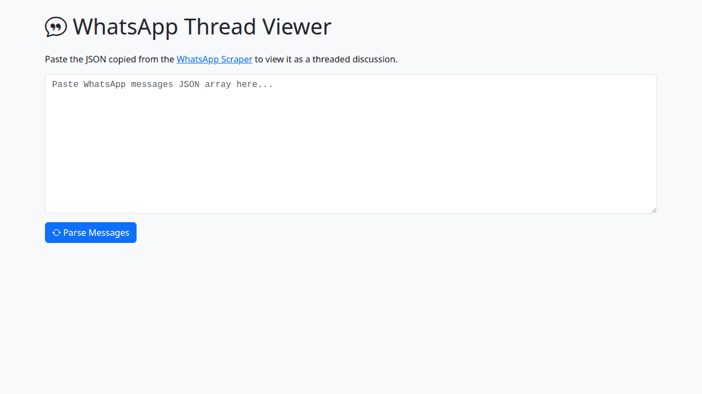

# WhatsApp Scraped JSON Chat Viewer

This tool renders a JSON array of WhatsApp messages, typically generated by a scraper like the `whatsappscraper` tool, into a more readable, threaded discussion format. It helps visualize conversations, especially replies, from scraped WhatsApp data.

## What it does

The WhatsApp Thread Viewer takes a JSON array representing a WhatsApp conversation and displays it as a list of messages, with replies nested under their original messages. It formats each message to show the author, text content, and timestamp.

Key Features:

- **JSON Input:** Expects a JSON array where each object represents a message and includes fields like `messageId`, `author`, `text`, `time`, and `quoteMessageId` for replies.
- **Threaded View:** Correctly identifies and nests replies under their parent messages, making it easy to follow conversation threads.
- **Clear Formatting:** Displays messages with author names, message content, and timestamps (date and time).
- **Optimized Date Display:** The date is only shown for a message if it's different from the date of the immediately preceding message, reducing visual clutter.

**Note:** This tool is designed for JSON data, specifically the kind produced by the companion `whatsappscraper` tool. It is **not** intended for viewing standard WhatsApp chat export `.txt` files.

## Use Cases

- **Reviewing Scraped Chats:** Provides a user-friendly way to read through WhatsApp conversations that have been extracted in JSON format.
- **Understanding Conversation Flow:** The threaded view helps in understanding the context of replies and how different parts of a conversation connect.
- **Offline Chat Reading:** Once chats are scraped into JSON, this tool allows for offline viewing in a structured manner.
- **Analyzing Scraped Data:** Before or after programmatic analysis of scraped JSON, this tool can offer a visual check of the conversation structure.

## How It Works

1.  **Input JSON:**

    - The user pastes a JSON array of WhatsApp messages into the provided textarea. This JSON is expected to be from a tool like `whatsappscraper`.

2.  **Parse Messages:**

    - Upon clicking the "Parse Messages" button:
      - The input JSON string is parsed into an array of JavaScript objects.
      - The `threadMessages` function processes these messages:
        - It creates a map of messages using their `messageId` for quick lookups.
        - It iterates through each message. If a message contains a `quoteMessageId` (indicating it's a reply), it's added to a `replies` array within the message object it's replying to.
        - Messages without a `quoteMessageId` are considered top-level messages.

3.  **Render Threads:**
    - The `renderThreads` function takes the processed list of top-level messages (which now may contain nested `replies`).
    - It generates HTML to display each message thread.
    - For each message (and each reply), it displays:
      - The author's name.
      - The message text.
      - The time of the message.
      - The date of the message (only if it's different from the previously displayed message's date to avoid repetition).
    - Replies are visually indented under their parent message with a border to indicate the threading.

The tool is a single-page web application built with HTML, Bootstrap for styling, and client-side JavaScript for all parsing and rendering logic. It does not require any backend or external API calls beyond loading its own assets.
